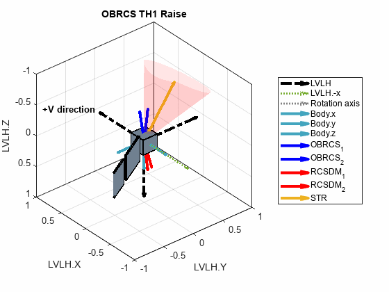
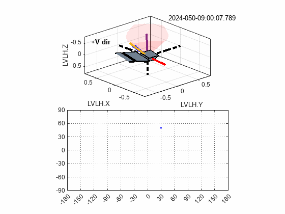

# Satellite Quaternion Attitude Animation
## (SQAA v.1, pre-release v.2)
Satellite Quaternion Attitude Animation (SQAA) is a tool to simulate rotation via quaternion, 
and has the capability of inputting on-orbit data to animate actual behaviour, 
while plotting groundtrack data.

# Results

  
  

> [!IMPORTANT]  
> This is still an on-going work as more feature will be added into SQAA in future releases. 

