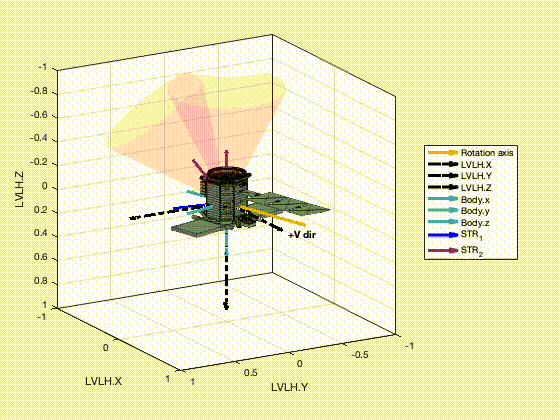

# Satellite Attitude Animation and Simulator
## (SAAS v.1.0-beta.1)

Satellite Attitude Animation and Simulator (SAAS) is a tool that simulates satellite attitude describe by quaternions,
and has the capability of inputting on-orbit data to animate actual behaviour, 
while plotting groundtrack data.
---
## Modes
1. ATT_SIM: Provide simulation on user input quaternion and input environment
2. ATT_PROP: Based on INPUT_PROP.txt file for on-orbit satellite attitude simulation
---
## INPUT format
```
=[ Optimised transfer, unperturb ]=
TITLE INPUT_SIM.txt

MODE  simulation
MODEL 
        NAME    FS9
        CG     [CG_x CG_y CG_z]
        OFF    [OFF_x OFF_y OFF_z]
        FILE   'model/model.stl'
END
ENV
        BETA_ANGLE 15
END
COMPONENT 
        STR1    [start_x start_y start_z]
                [end_x end_y end_z]
        STR2    [start_x start_y start_z]
                [end_x end_y end_z]
        USER    [start_x start_y start_z]
                [0, 0, 0]
END
OPTION
        STR_VIEW   0
END
VALUE
        DESIGN         1
        FRAME         'ECI'
        QUAT_DESIGN   [0, -240, 50]
        QUAT_SINGLE   []
        QUAT_PROF     'QUAT_PROFILE.txt'
END
```

# Results
<p align="center">
  
  
  
</p>


> [!IMPORTANT]  
> This is still an on-going work as more feature will be added into SAAS in future releases. 


