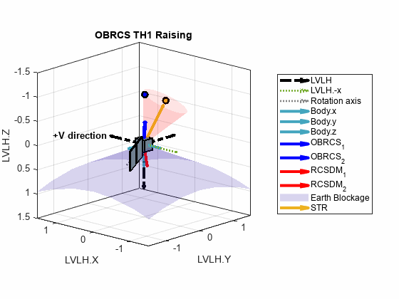

# Satellite Attitude Animation and Simulator
## (SAAS v.1, pre-release v.2)
Satellite Attitude Animation and Simulator (SAAS) is a tool that simulates satellite attitude describe by quaternions,
and has the capability of inputting on-orbit data to animate actual behaviour, 
while plotting groundtrack data.

## Modes
1. OCM operation via single quaternion (LVLH frame) (upper left corner)
2. On-orbit data display and visualisation --> attitude + groundtrack (eclipse included) (upper right corner)
3. Basic orbit wizard/simulation (ECI + ECEF + groundtrack) (bottom)

# Results

  
  
  

> [!IMPORTANT]  
> This is still an on-going work as more feature will be added into SAAS in future releases. 

